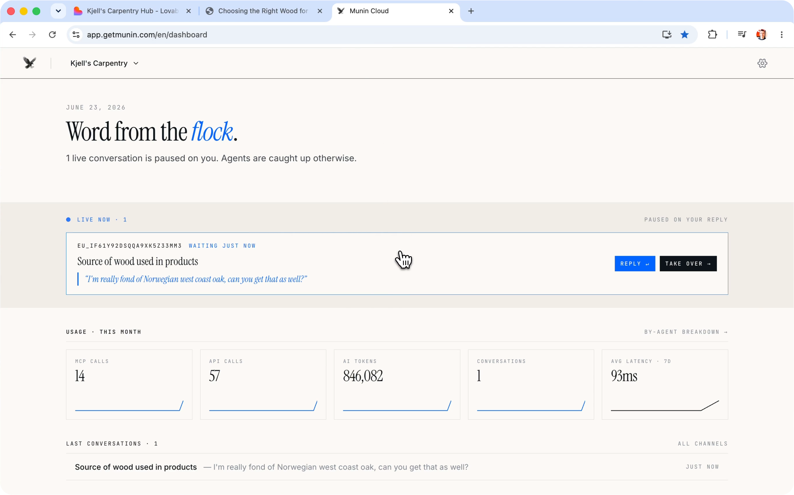
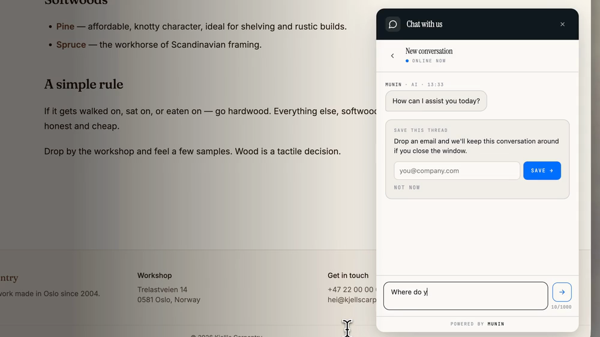
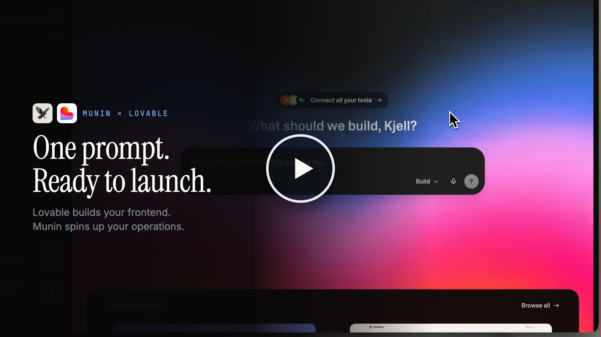

# Munin

> Open-source, headless HubSpot alternative.

<p align="left">
  <a href="https://github.com/getmunin/munin/blob/main/LICENSE"></a>
  <a href="https://github.com/getmunin/munin/commits/main"></a>
  <a href="https://registry.modelcontextprotocol.io"></a>
</p>

<p align="left">
  <a href="https://www.getmunin.com"><b>Website</b></a> ·
  <a href="https://vimeo.com/1204180225?autoplay=0&utm_source=github&utm_medium=readme&utm_campaign=demo-video"><b>See it in action</b></a> ·
  <a href="https://www.getmunin.com/en/docs/"><b>Documentation</b></a> ·
  <a href="https://registry.modelcontextprotocol.io"><b>MCP Registry</b></a>
</p>

CRM, conversations, outreach, CMS, knowledge base, and analytics on one Postgres schema — exposed as tools your agents drive, not screens you click through. Headless the way a headless CMS is: there's a thin dashboard for settings, auth, and human-in-the-loop review, but the apps themselves have no admin UI. Every action runs through MCP tools, callable from any MCP-compatible client (Claude, Cursor, ChatGPT, custom runners) — same tools, same permissions, same audit log, whether a human or an agent is driving. Munin even ships its own: an in-process, per-org agent runner that answers live conversations and works the curation queue against an LLM provider you configure — so the platform runs out of the box, with external MCP clients optional.

<p align="center">
  <br>
  <sub><b>The dashboard</b> — a thin shell for settings, auth, and human-in-the-loop review. No admin UI for app data; it drives the same MCP tools your agents call.</sub>
</p>

<p align="center">
  <br>
  <sub><b>The embeddable chat widget</b> — answering a live customer from the knowledge base, ready to hand off to a human and be picked back up by the agent.</sub>
</p>

## Modules at a glance

| Module | Tools | What it does |
|---|---|---|
| Knowledge Base | `kb_*` | documents, hybrid search, audience scoping |
| Conversations | `conv_*` | channels, messages, handover |
| CRM | `crm_*` | contacts, companies, deals |
| CMS | `cms_*` | collections, entries, assets |
| Outreach | `outreach_*` | campaigns, drafts, propose-only |
| Analytics | `analytics_*` | page-view + search events |

These six modules aren't separate products — they share one Postgres schema, one permission model, and one audit log. Watch how they tie together:

<p align="center">
  <a href="https://vimeo.com/1202399440?autoplay=0&utm_source=github&utm_medium=readme&utm_campaign=promo-video">
    
  </a>
</p>

## Core modules

#### Knowledge Base
- Markdown articles organized into spaces, each scoped to the audiences allowed to see it.
- Hybrid search that blends keyword matching with meaning-based results.
- Website import — crawl a public site and turn each page into an article in the background, automatically dropping articles when their source page disappears.
- Full version history with restore, plus a review queue for proposed edits.

#### Conversations
- One inbox across email, chat widget, voice (Threll.ai / Vapi), and SMS (Twilio / MessageBird).
- Inbound *and* outbound — agents answer conversations and can place outbound calls.
- Assignable, organized by topic, and searchable across every message.
- Built-in handoff to a human, with notifications to your own systems as conversations change.

#### CRM
- Contacts, companies, deals, activities, pipelines, and segments.
- AI-written summaries and suggested next actions, kept separate from what people edit by hand.
- Consent tracking — the lawful basis and source for each contact, required before they can be added to any outreach.
- Automatic duplicate detection that proposes merges for review, plus bulk contact import.

#### CMS
- Content collections with structured fields, and entries you can publish in multiple languages.
- Rich content blocks for article bodies — callouts, quotes, media, and more.
- Scheduled publishing and a media library for images and files.
- Full version history with restore, search, and cross-references between entries.
- A public content API serves your site or app, with engagement tracking built into every entry.

#### Outreach
- Propose-only outbound email — campaigns, segments, and drafts for both first touches and replies.
- Recipients are drawn only from contacts who have recorded consent (see CRM).
- Every message waits for human approval; nothing is ever sent automatically.

#### Analytics
- Captures page views and on-site searches across anything you want to measure.
- CMS pages are tracked automatically; for any other page, you add a small tracking snippet.
- Conversion funnels and per-visitor journeys — once someone is identified, their visits link to a CRM contact, including the anonymous ones from before.
- Breakdowns by traffic source, referrer, and country, plus "what to write next" signals (popular topics, engagement, and searches that came back empty).

## Automation

#### Conversation loop
An in-process, per-org agent runner answers live conversations on every channel (chat widget, email, SMS, voice) against the LLM provider you configure — drafting and sending replies, and handing off to a human when needed.

#### Curator loop
The in-process agent runner also works a durable background job queue: scheduled KB curation, CRM hygiene, contact extraction, stale-content review, and outreach drafts, with retry and dead-letter handling.

#### Playbooks & skills
Packaged markdown procedures (`skill://module/<verb-object>`) for multi-step, cross-module workflows, surfaced over MCP — followed both by Munin's own runner and by any external AI agent operating on the platform.

## Platform

#### Data portability
Symmetric `*_export` / `*_import` MCP tools (and `/v1/<module>/export|import` REST endpoints) per module, so an agent can move an org's data between a self-hosted server and the cloud in either direction. See `skill://playbooks/data-migration`.

#### Audit & webhooks
Every action is written to an audit log, and webhooks fan those events out to your own endpoints with signed, replayable deliveries.

#### Alerts & feedback
Operational issues surface as system alerts the agent can list, acknowledge, and resolve. An in-product feedback channel lets you file feature requests and vote on Munin's public roadmap.

#### Auth & access
Sign-in and access control run on BetterAuth, with OAuth 2.1 dynamic-client registration and team invites.

## See it in action

> Lovable builds your frontend. Munin spins up your operations. One prompt, one MCP endpoint — and the agents do the rest.

Watch Lovable build a real website from a single prompt while Munin stands up everything behind it — the CMS the blog reads from, a seeded knowledge base, analytics, and a chat widget that already knows the business. No click-ops, no screens to wire up; the agent does the work, over one MCP endpoint. Then a real customer conversation plays out: answered from the knowledge base, handed off to a human when it matters, and picked back up by the agent to close.

<p align="center">
  <a href="https://vimeo.com/1204180225?autoplay=0&utm_source=github&utm_medium=readme&utm_campaign=demo-video">
    
  </a>
</p>

## Two ways to run

**Self-host** (this repo): single-tenant, invite-only.

```bash
git clone https://github.com/getmunin/munin.git
cd munin
cp .env.example .env
docker compose up
```

Secrets left at their `.env.example` placeholders are auto-generated on first boot and persisted in the `munin-data` volume — fine for local self-hosting. For shared or production deployments, set strong `MUNIN_AUTH_SECRET` + `MUNIN_KEY_PEPPER` + `MUNIN_ENCRYPTION_KEY` values (`openssl rand -base64 48`) in `.env` instead.

The first user to sign up becomes the org admin; subsequent users need an invitation token or an email whose domain is in `MUNIN_ALLOWED_EMAIL_DOMAINS`.

**Hosted** (https://www.getmunin.com): multi-tenant, one signup per org.

## Try it locally

After `docker compose up`, the backend listens on `:3001` and the dashboard on `:3000`.

1. Open `http://localhost:3000` and register the first user — they become the singleton org admin.
2. In the dashboard, go to **Settings → API keys** and mint an admin key (`mn_admin_…`). Shown once; treat like a password.
3. Poke at the API and tools:

```sh
# REST control plane — direct, no OAuth
curl -s http://localhost:3001/v1/kb/spaces \
  -H "Authorization: Bearer mn_admin_..." | jq

# MCP tool browser (recommended for poking at tools/skills)
npx @modelcontextprotocol/inspector
# In its UI: URL = http://localhost:3001/mcp, Auth = Bearer mn_admin_...

# Raw curl over Streamable HTTP — useful for sanity-checking the transport
curl -N -X POST http://localhost:3001/mcp \
  -H "Authorization: Bearer mn_admin_..." \
  -H "Content-Type: application/json" \
  -H "Accept: application/json, text/event-stream" \
  -d '{"jsonrpc":"2.0","id":1,"method":"tools/list"}'
```

The OpenAPI spec for the REST control plane is at `packages/backend-core/openapi.json`. To wire an MCP client like Claude or Cursor, see [Connect your AI agent](#connect-your-ai-agent) below.

## Connect your AI agent

Once you've signed up (hosted) or run `docker compose up` (self-host), point your MCP client at the URL — `http://localhost:3001/mcp` for self-host, or `https://mcp.getmunin.com` for hosted.

**Claude Code (CLI):**

```sh
claude mcp add munin http://localhost:3001/mcp
```

**Claude Desktop** — add to your MCP config:

```json
{
  "mcpServers": {
    "munin": {
      "url": "http://localhost:3001/mcp"
    }
  }
}
```

The first call triggers an OAuth consent screen in your browser, then your agent has the full tool surface — Knowledge Base, Conversations, CRM, CMS, Outreach, Analytics.

## Two trust contexts, one MCP endpoint

The same `/mcp` endpoint serves two distinct callers, audience-aware:

- **Admin agents** (Claude Desktop, Cursor, internal automation) — OAuth-authorized by you. Full tool surface, scope-gated per `kb:*`, `conv:*`, `crm:*`, `cms:*`, `outreach:*`, `analytics:*`.
- **End-user agents** (your voice AI, web chatbot, mobile app helper) — short-lived delegated tokens minted server-side from your backend, scoped to one of your end-users. Only self-service tools (read your own contact, send a message in your own conversation).

See `packages/backend-core/src/control/delegated-token.controller.ts` for the token-mint API. The `@getmunin/sdk` Node client wraps it.

## Stack

| Layer | Tech |
|---|---|
| Language & runtime | TypeScript, Node 24 LTS |
| Monorepo | Turborepo, pnpm |
| Backend | NestJS |
| Frontend | Next.js |
| Data | Postgres + pgvector, Drizzle |
| Protocol & auth | MCP Streamable HTTP, BetterAuth + OAuth 2.1 |

## Documentation

Developer docs live at **[getmunin.com/docs](https://www.getmunin.com/en/docs/)** — guides, the REST API reference, the full MCP tool list, and the skill library.

## Contributing

Contributions are welcome. `pnpm install`, then `docker compose up` (or `pnpm dev`) gives you a full stack on `:3001` (backend) and `:3000` (dashboard). Branch from `main` as `<type>/<kebab-summary>` (e.g. `feat/website-import-reconcile`), keep PRs focused, and make sure CI (lint, typecheck, test, build) passes.

See [CONTRIBUTING.md](./CONTRIBUTING.md) for setup, commit conventions, and PR guidelines.

## Security

Found a vulnerability? Please **don't** open a public issue — email **security@getmunin.com** instead. See [SECURITY.md](./SECURITY.md) for scope and our response timeline.

## License

MIT. See [LICENSE](./LICENSE).

Bundled third-party dependencies retain their own licenses — see [THIRD_PARTY_LICENSES.md](./THIRD_PARTY_LICENSES.md) (generated by `pnpm licenses:generate`, verified in CI).
