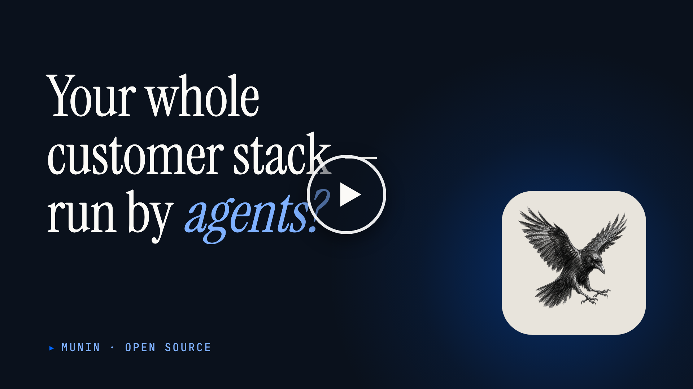

# Munin

> MCP-first customer platform made for the agentic era. The agent is the UI.

Munin is an open-source customer platform built for the agentic era (Knowledge Base, Conversations, CRM, CMS, Outreach, Analytics) where the only interface is via AI agents. There is no traditional admin UI for the apps themselves — every action runs through MCP tools, callable from any MCP-compatible client.

<p align="center">
  <a href="https://vimeo.com/1202399440?autoplay=0&utm_source=github&utm_medium=readme&utm_campaign=promo-video">
    
  </a>
</p>

## Why I built this

Hi — Kjell here. Last year my company was paying HubSpot $500/month for three users who barely touched it. Every workflow worth having lived a tier above the one we were on.

Then our AI agents started doing the prospecting and outreach themselves, and it hit me: what we still used HubSpot for had shrunk to basic CRUD. The agent does the work; HubSpot just stored the record. I wasn't going to keep paying $500/month for CRUD.

So I built the thing I actually wanted. Over roughly a month, with Claude Code as my primary IDE, Munin went from nothing to what's in this repo. I've shipped production software for about twenty years — that experience is what shaped the architecture and let me catch the agent when it got things wrong. Claude Code took the labor of typing it out of the equation; a year ago I don't think this would have been feasible solo.

Munin isn't the AI — it's what your AI uses. You bring the agent, write the prompts, wire up the workflows; Munin's job is to be the cleanest possible tool surface underneath. It's open source and yours to run.

## What's in the box

- **Knowledge Base** — markdown documents, hybrid search (BM25 + pgvector embeddings), per-document audience scoping.
- **Conversations** — multi-channel threads (email, voice via Threll.ai or Vapi, SMS via Twilio or MessageBird, chat widget) routed to end-users, assignable, agent-resolvable, with handover state and webhook fan-out.
- **CRM** — contacts, companies, deals, activities, pipelines, segments, plus a merge-proposal queue the `clean-contact-data` curator runs against.
- **CMS** — agent-authored content collections with field schemas, localized entries, scheduled publishing, an asset library backed by S3-compatible storage, and a public delivery API that ships a `_tracking` block on every entry for built-in engagement signal.
- **Outreach** — propose-only outbound emails: campaigns + segments + drafts queued for human approval; never auto-sends.
- **Analytics** — polymorphic page-view + search-query ingestion. CMS delivery wires in for free; arbitrary pages drop in a `<script src="…/tracker.js" data-key="mn_track_…">` tag. Read tools (`analytics_list_top_subjects`, `analytics_get_subject_engagement`, `analytics_list_zero_result_searches`) feed the "what should we write next" loop into curator skills like `cms/review-stale-entries`.
- **Curator** — durable background job queue running skills (KB curation, CRM hygiene, contact extraction, stale-content review, outreach drafts) on a schedule with retry + dead-letter.
- **Playbooks + skills** — packaged markdown procedures (`skill://module/<verb-object>`) the agent reads via MCP resources to follow multi-step flows.
- **Cross-cutting** — audit log, webhooks, team invites, OAuth 2.1 dynamic-client registration, BetterAuth-backed sign-in.

## Two ways to run

**Self-host** (this repo): single-tenant, invite-only.

```bash
git clone https://github.com/getmunin/munin.git
cd munin
cp .env.example .env  # edit MUNIN_AUTH_SECRET + MUNIN_KEY_PEPPER + MUNIN_ENCRYPTION_KEY
docker compose up
```

The first user to sign up becomes the org admin; subsequent users need an invitation token or an email whose domain is in `MUNIN_ALLOWED_EMAIL_DOMAINS`.

**Hosted** (https://getmunin.com): multi-tenant, one signup per org.

## Try it locally

After `docker compose up`, the backend listens on `:3001` and the dashboard on `:3000`.

1. Open `http://localhost:3000` and register the first user — they become the singleton org admin.
2. In the dashboard, go to **Settings → API keys** and mint an admin key (`mn_admin_…`). Shown once; treat like a password.
3. Pick one of:

```sh
# REST control plane — direct, no OAuth
curl -s http://localhost:3001/v1/kb/spaces \
  -H "Authorization: Bearer mn_admin_..." | jq

# MCP tool browser (recommended for poking at tools/skills)
npx @modelcontextprotocol/inspector
# In its UI: URL = http://localhost:3001/mcp, Auth = Bearer mn_admin_...

# Claude Code (CLI)
claude mcp add munin-local http://localhost:3001/mcp
# Then `claude` → OAuth flow opens in browser → tools available

# Claude Desktop — claude_desktop_config.json
# {
#   "mcpServers": { "munin": { "url": "http://localhost:3001/mcp" } }
# }

# Raw curl over Streamable HTTP — useful for sanity-checking the transport
curl -N -X POST http://localhost:3001/mcp \
  -H "Authorization: Bearer mn_admin_..." \
  -H "Content-Type: application/json" \
  -H "Accept: application/json, text/event-stream" \
  -d '{"jsonrpc":"2.0","id":1,"method":"tools/list"}'
```

The OpenAPI spec for the REST control plane is at `packages/backend-core/openapi.json`.

## Connect your AI agent

Once you've signed up (hosted) or run `docker compose up` (self-host), point your MCP client at the URL.

**Claude Desktop / Code** — add to your MCP config:

```json
{
  "mcpServers": {
    "munin": {
      "url": "http://localhost:3001/mcp"
    }
  }
}
```

(For the hosted version, swap in `https://mcp.getmunin.com`.) The first call triggers an OAuth consent screen in your browser, then your agent has the full tool surface — Knowledge Base, Conversations, CRM, CMS, Outreach, Analytics.

## Documentation

Developer docs live at **[getmunin.com/docs](https://www.getmunin.com/en/docs/)** — guides, the REST API reference, the full MCP tool list, and the skill library.

## Two trust contexts, one MCP endpoint

The same `/mcp` endpoint serves two distinct callers, audience-aware:

- **Admin agents** (Claude Desktop, Cursor, internal automation) — OAuth-authorized by you. Full tool surface, scope-gated per `kb:*`, `conv:*`, `crm:*`, `cms:*`, `outreach:*`, `analytics:*`.
- **End-user agents** (your voice AI, web chatbot, mobile app helper) — short-lived delegated tokens minted server-side from your backend, scoped to one of your end-users. Only self-service tools (read your own contact, send a message in your own conversation).

See `packages/backend-core/src/control/delegated-token.controller.ts` for the token-mint API. The `@getmunin/sdk` Node client wraps it.

## Architecture sketch

- `apps/backend` — thin NestJS entry composing `@getmunin/backend-core` modules with single-tenant `AuthModule`. Exposes the MCP server (Streamable HTTP), OAuth 2.1 + OIDC discovery, and the control-plane REST API on port 3001.
- `apps/web` — Next.js dashboard + landing on port 3000.
- `apps/chat-widget` — embeddable browser widget that consumes a `mn_widget_*` key and the widget ingest API.
- `apps/analytics-tracker` — embeddable browser tracker, served at `/tracker.js`, that consumes a public `mn_track_*` key and writes page-view events.
- `packages/backend-core` — every shared NestJS module (KB, Conversations, CRM, CMS, Outreach, Analytics, Curator, Web, Playbooks, MCP, control plane, audit, tenancy, RLS, mailer, storage, webhooks, rate limit, quotas, OAuth) plus `createApp` and the `createAuthController` helper. Cloud composes the same modules with multi-tenant auth.
- `packages/dashboard-pages` — dashboard page components shared between OSS and cloud webs.
- `packages/ui` — design-system primitives (shadcn-style).
- `packages/{core, db, types, sdk, mcp-toolkit}` — non-Nest building blocks: actor identity + tenancy GUCs, Drizzle schema + migrations, shared types, Node client SDK, MCP `@McpTool` / `@SkillRegistry` decorators.
- `packages/{agent-host, agent-runtime}` — durable per-org agent runner that picks curator jobs off the queue and executes them against the configured LLM provider.
- `packages/widget-voice` — vendor-agnostic browser voice SDK for the chat widget (Threll.ai WebRTC + Vapi) behind a common `VoiceSession` interface.
- All `@getmunin/*` packages are published to GitHub Packages.

## Stack

TypeScript · Node 24 LTS · Turborepo · pnpm · NestJS · Next.js · Drizzle · Postgres + pgvector · MCP Streamable HTTP · BetterAuth + OAuth 2.1 dynamic client registration

## License

MIT. See [LICENSE](./LICENSE).

Bundled third-party dependencies retain their own licenses — see [THIRD_PARTY_LICENSES.md](./THIRD_PARTY_LICENSES.md) (generated by `pnpm licenses:generate`, verified in CI).
